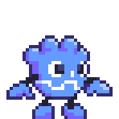
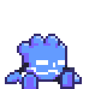

# Godot Plushie Viewport Pet

This Godot plugin adds a Viewport Pet (like a [Desktop Pet](https://itch.io/games/tag-desktop-pet)) to your Godot Editor!

</img>

This cuddly companion walks around, tries to get close to your cursor and even falls asleep when you're not using the editor!

</img>

The sprites were done by the talented [SplendidDog](https://splendiddog.itch.io/) and are available on [Itch.io](https://splendiddog.itch.io/simply-plush)!

Feel free to change every aspect of the pet by modifying [godot_plushie.tscn](addons/godot_plushie/godot_plushie.tscn) and [godot_plushie.gd](addons/godot_plushie/godot_plushie.gd)!

